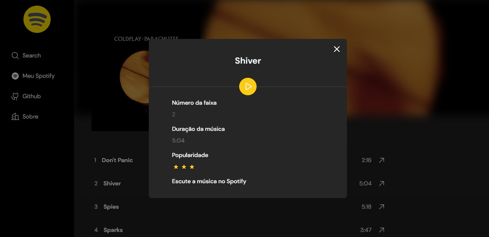

<h1 align='center'>
    

   <p align="center">
      
      
      
      
      
  </p>  
</h1>


  <p align="center">
  <a href="#-Horizonfy"> Sobre</a>&nbsp;&nbsp;|&nbsp;&nbsp;
  <a href="#-Deploy"> Deploy </a>&nbsp;&nbsp;|&nbsp;&nbsp;
  <a href="#-Tecnologias"> Tecnologias </a>&nbsp;&nbsp;|&nbsp;&nbsp;
  <a href="#-Funcionalidades"> Funcionalidades  </a>&nbsp;&nbsp;|&nbsp;&nbsp;
  <a href="#-Como-rodar-a-aplicação">  Configurações  </a>&nbsp;&nbsp;
</p>


<div align='center'>
  
</div>


## 🎶 Horizonfy
Horizonfy é uma aplicação que simula algumas das funcionalidades do mais famoso player de música. Para isso utiliza-se a [API do Spotify](https://developer.spotify.com/documentation/web-api) com o objetivo de resgatar álbuns, faixas de músicas e informações sobre discos de acordo com o interesse do usuário. Além disso também é possível escutar versões demos de algumas das faixas do álbum escolhido.

## 🎉 Deploy
O projeto foi hospedado na Vercel, e você pode conferir a versão live em [Horizonfy](https://horizonfy.vercel.app/).
## 🧪 Tecnologias
- [React](https://react.dev/)
- [TypeScript](https://www.typescriptlang.org/docs/)
- [ESLint](https://eslint.org/docs/latest/)
- [NPM](https://www.npmjs.com/)
- [Vite](https://vitejs.dev/guide/)
- [Tailwind](https://tailwindcss.com/docs/guides/nextjs)
- [Axios](https://axios-http.com/)
- [Radix](https://developer.mozilla.org/pt-BR/docs/Web/CSS)
- [Vercel](https://vercel.com/)
- [Phosphor Icons](https://phosphoricons.com/)

## ✨ Funcionalidades
- [X] Buscar por álbuns por qualquer termo
- [X] Exibir os 10 melhores resultados
- [X] Exibir informações sobre o álbum
- [X] Acessar faixas de um álbum
- [X] Ver informações sobre uma faixa específica
- [X] Reproduzir música escolhida do álbum

#### Melhorias
- [ ] Criar Loading para os components.
- [ ] Tela de Login para autenticação do usuário.
- [ ] Exibir informações do Spotify do usuário.
- [ ] Usar React Query


## 🔧 Como rodar a aplicação

**1.** Primeiramente você deve ter o arquivo `.env` configurado na raiz do projeto com as variáveis de ambiente que podem ser criadas através desse [link](https://developer.spotify.com/dashboard/create)
na API do Spotify

**2.** Em **Redirect URI** preencha com `http://localhost:5173`

**3.** Após criado o projeto, você terá acesso aos valores do seu `Client ID` e ao `Client Secret` para serem colocados no arquivo `.env` - confira o exemplo em [env-example](/.env.example)


**OBS**
- Para o deploy utilizei as minhas variávies de ambiente.

```bash
# Clone o projeto
$ git clone https://github.com/pedrovinhas/horizonfy.git

# Instale as dependências
$ npm install

# Rode a aplicação
$ npm run dev

```

---
<blockquote> Feito por Pedro Henrique Vinhas 🪐 </blockquote>

